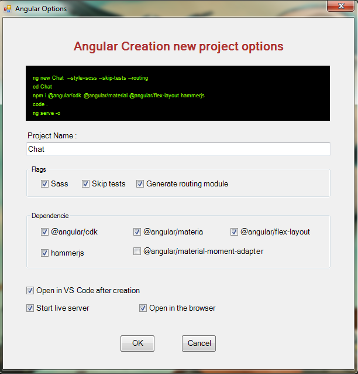
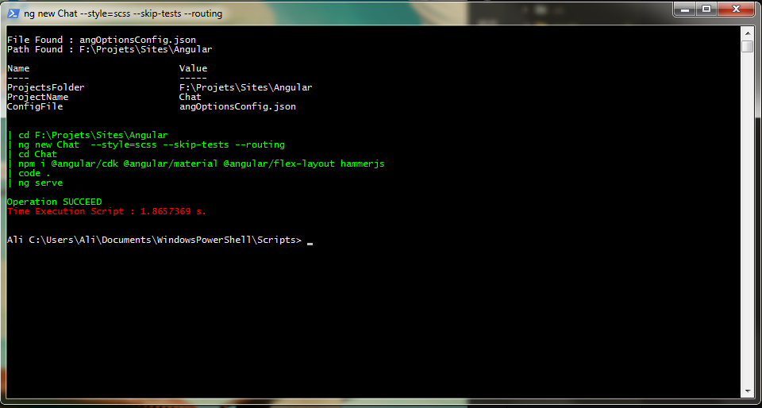
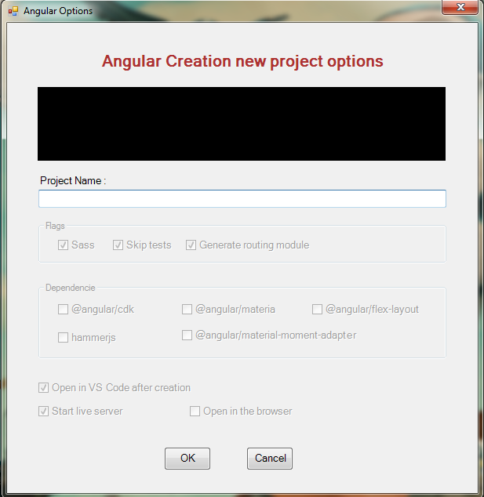

# GUI Frameworks - Powershell

Powershell GUI to automate the creation of framework's projects and actions.

|Command|Required|Description|
|-------|--------|-----------|
|`ngCreate`|True|Start the GUI|
|`-N` (-ProjectInitName)|False|The project name|
|`-S` (-Simulation)|False|Simulation mode of the commands|

Example :

```ini
ngCreate -N Chat
```





## TODO

> Add other frameworks